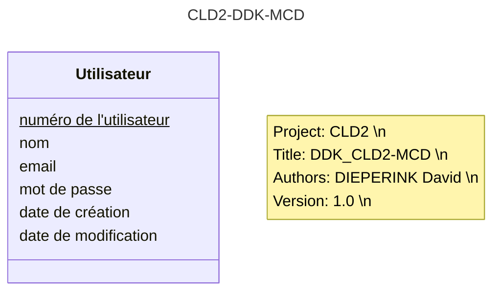
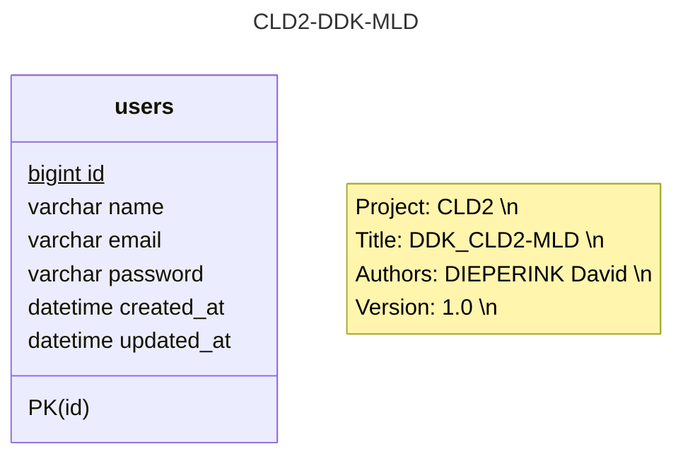

# Documentation base de données

## Notes

Les utilisateurs sont stockés dans une base de données MySql (MariaDB).

## MCD



## MLD

## Logical Data Model



## Rake

> Documentation de rake : https://ruby.github.io/rake/

### Création

```bash
bundle exec rake db:create
```

### Run les migrations

```bash
bundle exec rake db:migrate
```
